<h2>TensorFlow-FlexUNet-Image-Segmentation-CamVid-11-Classes (2025/12/14)</h2>

Toshiyuki Arai 
Software Laboratory antillia.com 
 
This is the first experiment of Image Segmentation for <b>Cambridge-driving Labeled Video Database (CamVid) 11 Classes </b> based on 
our <a href="./src/TensorFlowFlexUNet.py">TensorFlowFlexUNet</a>
 (<b>TensorFlow Flexible UNet Image Segmentation Model for Multiclass</b>)
, and a 682x512  pixels PNG 
<a href="https://drive.google.com/file/d/1fyJEe6NeLlWqitoSio1gJRfm1L4QB8NT/view?usp=sharing">
<b>Augmented-CamVid11-ImageMask-Dataset.zip</b></a>
which was derived by us from   
<b>CamVid_RGB</b> and <b>CamVidColor11</b> in 
<a href="https://github.com/lih627/CamVid">Cambridge-driving Labeled Video Database (CamVid)</a>
  

<b>Actual Image Segmentation for the CamVid11 of 682x512 pixels</b> 
As shown below, the inferred masks predicted by our segmentation model trained on the 
dataset appear similar to the ground truth masks, but they lack precision in certain areas. 
<a href="#color_class_mapping_table">CamVid-11 Image color-class-mapping-table</a>
 
 
<table>
<tr>
<th>Input: image</th>
<th>Mask (ground_truth)</th>
<th>Prediction: inferred_mask</th>
</tr>
<tr>
<td></td>
<td>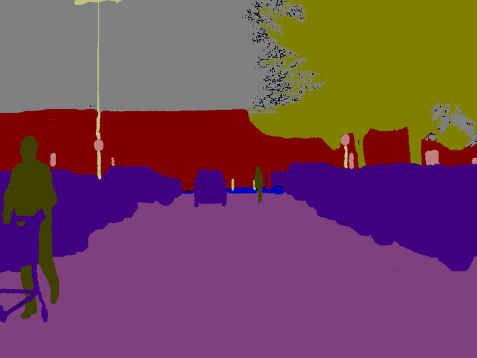</td>
<td></td>
</tr>
</tr>
<td>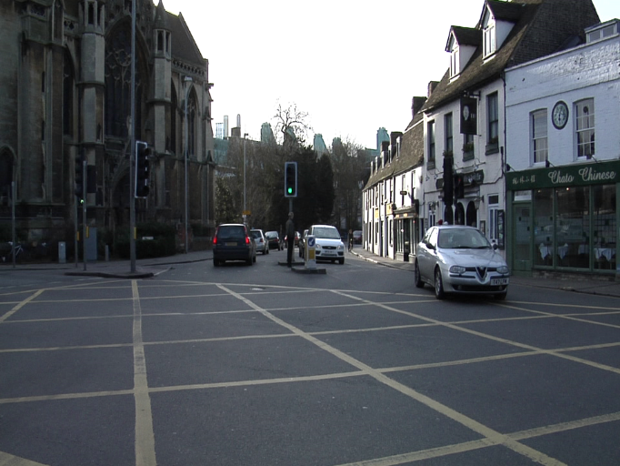</td>
<td>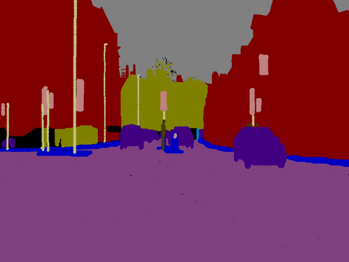</td>
<td></td>
</tr>
<tr>
<td>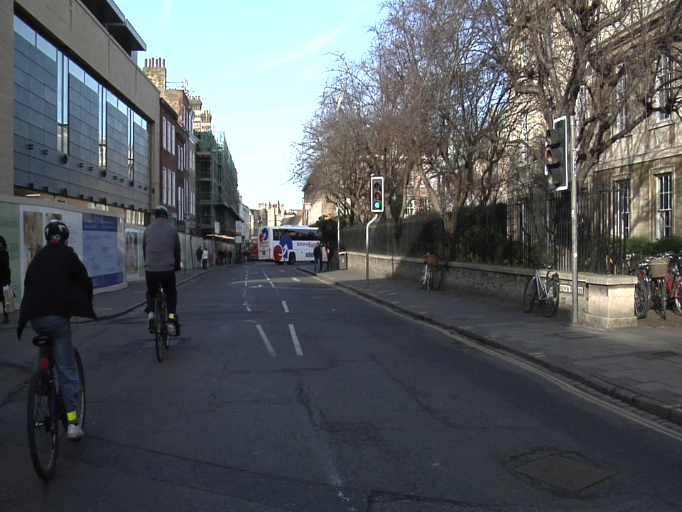</td>
<td>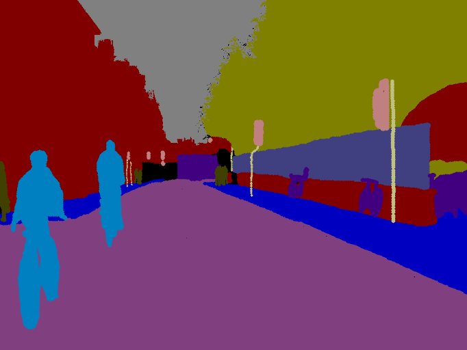</td>
<td></td>
</tr>
</table>

 
<h3>
1 Dataset Citation
</h3>
The dataset used here was derived from  
CamVid_RGB and CamVidColor11 in 
<a href="https://github.com/lih627/CamVid">Cambridge-driving Labeled Video Database (CamVid)</a>
  
The Cambridge-driving Labeled Video Database (CamVid) is the first collection of videos with object class semantic labels, 
complete with metadata. The database provides ground truth labels that associate each pixel with one of 32 semantic classes.
  
On more information, please refer to <a href="https://mi.eng.cam.ac.uk/research/projects/VideoRec/CamVid/">
  Motion-based Segmentation and Recognition Dataset</a>
   
  
This repository contains:
<ul>
<li>
A backup for original CamVid dataset(32 category labels).
</li>
<li>
11 category labels and training grayscale images for CamVid dataset.
</li>
<li>
Scripts to generate 11 cateogry labels from the original 32 category labels.
</li>
<li>
CamVid dataset split to train/va l/test set, which is the same as SegNet.
</li>
</ul>
<b>License</b> 
<a href="https://github.com/lih627/CamVid?tab=MIT-1-ov-file#readme">
 MIT license
</a>
 
 
<h3>
2  CamVid11 ImageMask Dataset
</h3>
<h4>2.1 Download  CamVid11</h4>
 If you would like to train this CamVid11 Segmentation model by yourself,
 please download <a href="https://drive.google.com/file/d/1fyJEe6NeLlWqitoSio1gJRfm1L4QB8NT/view?usp=sharing">
 <b>Augmented-CamVid11-ImageMask-Dataset.zip</b></a>
on the google drive, expand the downloaded, and put it under dataset folder to be:
<pre>
./dataset
└─CamVid11
    ├─test
    │  ├─images
    │  └─masks
    ├─train
    │  ├─images
    │  └─masks
    └─valid
        ├─images
        └─masks
</pre>
<b>CamVid11 Statistics</b> 
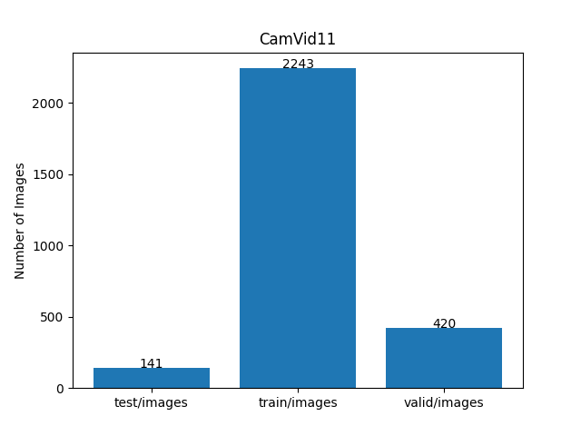 
 

As shown above, the number of images of train and valid datasets is large enough to use for a training set of our segmentation model.
   

<h4>2.2 CamVid11 Derivation</h4>
The data folder structure of the original <a href="https://github.com/lih627/CamVid">Cambridge-driving Labeled Video Database (CamVid)</a>
 is the following.
<pre>
./data
├─CamVidColor11
├─CamVidGray
├─CamVid_Label
├─CamVid_RGB
└─SegNetanno
</pre>
For simplicity and demonstration purposes,we used <b>CamVidColor11</b> (11 classes) and <b>CamVid_RGB</b> to generate
the 682x512 pixels resized and augmented dataset of 11 classes. 
We used the following two Python scripts to generate our dataset.
<ul>
<li><a href="./generator/ImageMaskDatasetGenerator.py">ImageMaskDatasetGenerator.py</a></li>
<li><a href="./generator/split_master.py">split_master.py</a></li>
</ul>
We also used the following category and color mapping table in the Generator script to define a rgb_map 
for our mask format between indexed color and rgb_colors 
in <a href="./projects/TensorFlowFlexUNet/CamVid11/train_eval_infer.config">train_eval_infer.config</a>
.   
<b><a id ="color_class_mapping_table">CamVid-11 Image color-class-mapping-table</a></b> 

<table border=1 style='border-collapse:collapse;' cellpadding='5'>
<!-- <caption>CamVid 11 classes</caption> -->
<tr><th>Indexed Color</th><th>Color</th><th>RGB</th><th>Class</th></tr>
<tr><td>1</td><td with='80' height='auto'></td><td>(128, 128, 128)</td><td>Sky</td></tr>
<tr><td>2</td><td with='80' height='auto'></td><td>(128, 0, 0)</td><td>Building</td></tr>
<tr><td>3</td><td with='80' height='auto'></td><td>(192, 192, 128)</td><td>Pole</td></tr>
<tr><td>4</td><td with='80' height='auto'></td><td>(128, 64, 128)</td><td>Road</td></tr>
<tr><td>5</td><td with='80' height='auto'></td><td>(0, 0, 192)</td><td>SideWalk</td></tr>
<tr><td>6</td><td with='80' height='auto'></td><td>(128, 128, 0)</td><td>Tree</td></tr>
<tr><td>7</td><td with='80' height='auto'></td><td>(192, 128, 128)</td><td>SignSymbol</td></tr>
<tr><td>8</td><td with='80' height='auto'></td><td>(64, 64, 128)</td><td>Fence</td></tr>
<tr><td>9</td><td with='80' height='auto'></td><td>(64, 0, 128)</td><td>Car</td></tr>
<tr><td>10</td><td with='80' height='auto'></td><td>(64, 64, 0)</td><td>Pedestrian</td></tr>
<tr><td>11</td><td with='80' height='auto'></td><td>(0, 128, 192)</td><td>Bicycle</td></tr>
</table>
 

<h4>2.3 CamVid11 Samples</h4>

<b>Train_images_sample</b> 
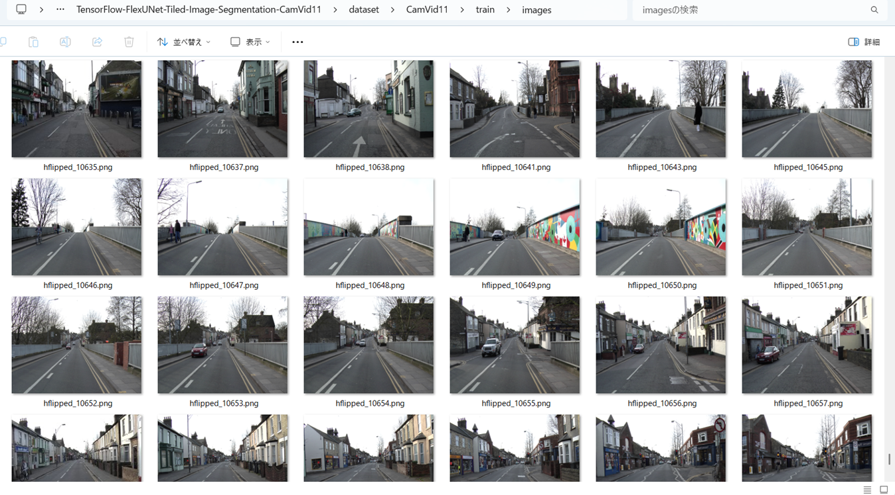
 
<b>Train_masks_sample</b> 
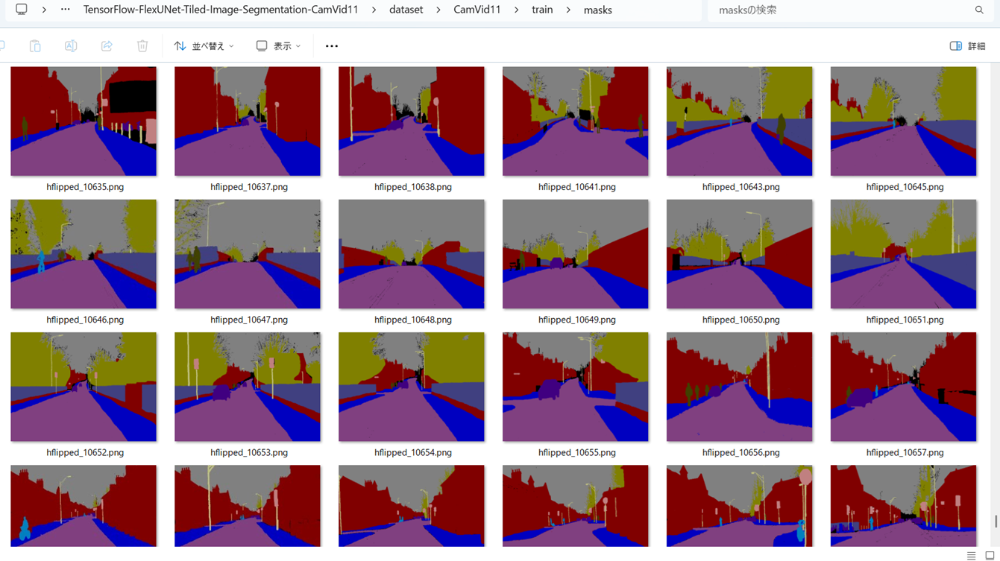
 
 
<h3>
3 Train TensorFlowFlexUNet Model
</h3>
 We trained CamVid11 TensorFlowFlexUNet Model by using the following
<a href="./projects/TensorFlowFlexUNet/CamVid11/train_eval_infer.config"> <b>train_eval_infer.config</b></a> file.  
Please move to ./projects/TensorFlowFlexUNet/CamVid11 and, and run the following bat file. 
<pre>
>1.train.bat
</pre>
, which simply runs the following command. 
<pre>
>python ../../../src/TensorFlowFlexUNetTrainer.py ./train_eval_infer.config
</pre>

<b>Model parameters</b> 
Defined a small <b>base_filters = 16</b> and a large <b>base_kernels = (11,11)</b> for the first Conv Layer of Encoder Block of 
<a href="./src/TensorFlowFlexUNet.py">TensorFlowFlexUNet.py</a> 
and a large num_layers (including a bridge between Encoder and Decoder Blocks).
<pre>
[model]
image_width    = 512
image_height   = 512
image_channels = 3
input_normalize = True
num_classes    = 12

base_filters   = 16
base_kernels   = (11,11)
num_layers     = 8
dropout_rate   = 0.05
dilation       = (1,1)

</pre>

<b>Learning rate</b> 
Defined a very small learning rate.  
<pre>
[model]
learning_rate  = 0.00007
</pre>

<b>Online augmentation</b> 
Disabled our online augmentation.  
<pre>
[model]
model         = "TensorFlowFlexUNet"
generator     = False
</pre>

<b>Loss and metrics functions</b> 
Specified "categorical_crossentropy" and <a href="./src/dice_coef_multiclass.py">"dice_coef_multiclass"</a>. 
You may specify other loss and metrics function names. 
<pre>
[model]
loss           = "categorical_crossentropy"
metrics        = ["dice_coef_multiclass"]
</pre>
<b>Learning rate reducer callback</b> 
Enabled learing_rate_reducer callback, and a small reducer_patience.
<pre> 
[train]
learning_rate_reducer = True
reducer_factor     = 0.5
reducer_patience   = 4
</pre>
<b>Early stopping callback</b> 
Enabled early stopping callback with patience parameter.
<pre>
[train]
patience      = 10
</pre>
<b>RGB Color map</b> 
<a href="#color_class_mapping_table">CamVid-11 Image color-class-mapping-table</a>
<pre>
[mask]
mask_datatype    = "categorized"
mask_file_format = ".png"
;           
; CamVid 1+11 classes              
rgb_map={(0,0,0):0,(128,128,128):1,(128,0,0):2,(192,192,128):3,(128,64,128):4,(0,0,192):5,(128,128,0):6,(192,128,128):7,(64,64,128):8,(64,0,128):9,(64,64,0):10,(0,128,192):11}
</pre>

<b>Epoch change tiled inference callback</b> 
Enabled <a href="./src/EpochChangeInferencer.py">epoch_change_infer callback (EpochChangeInferencer.py)</a></b>. 
<pre>
[train]
poch_change_infer     = False
epoch_change_infer_dir =  "./epoch_change_infer"
epoch_change_infer     = True
epoch_change_infer_dir =  "./epoch_change_infer"
</pre>

By using this callback, on every epoch_change, the tiled inference procedure can be called
 for 6 images in <b>mini_test</b> folder. This will help you confirm how the predicted mask changes 
 at each epoch during your training process.    

<b>Epoch_change_inference output at starting (epoch 1,2,3,4)</b> 
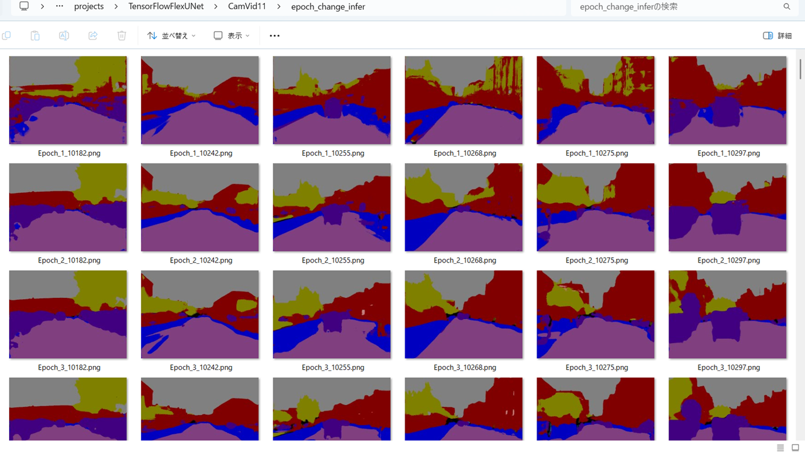 
 
<b>Epoch_change_inference output at middlepoint (epoch 32,33,34,35)</b> 
 
 

<b>Epoch_change_inference output at ending (epoch 65,66,67,68)</b> 
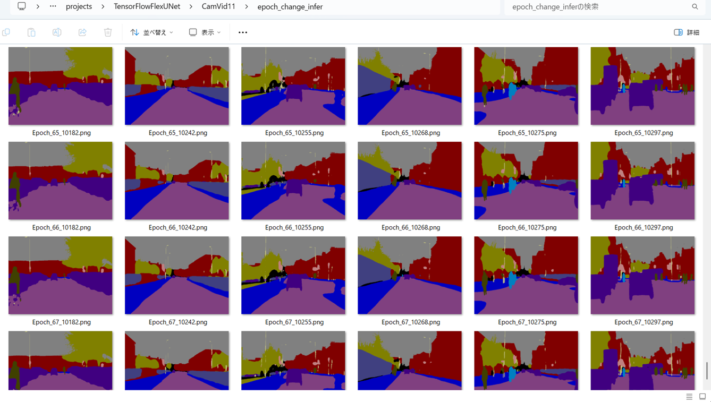 
 

In this experiment, the training process was stopped at epoch 68 by EarlyStoppingCallback.  
 
 

<a href="./projects/TensorFlowFlexUNet/CamVid11/eval/train_metrics.csv">train_metrics.csv</a> 
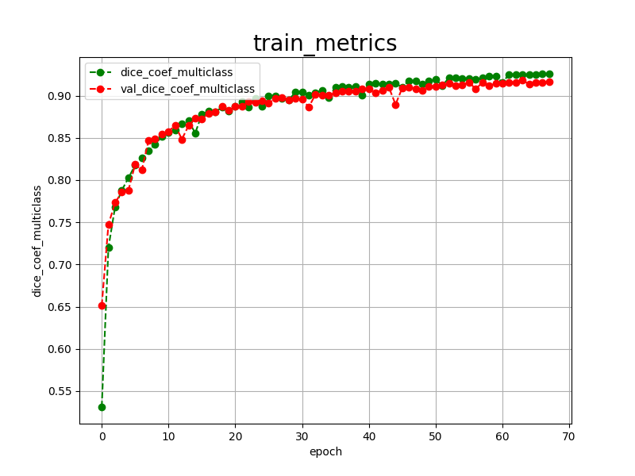 

 
<a href="./projects/TensorFlowFlexUNet/CamVid11/eval/train_losses.csv">train_losses.csv</a> 
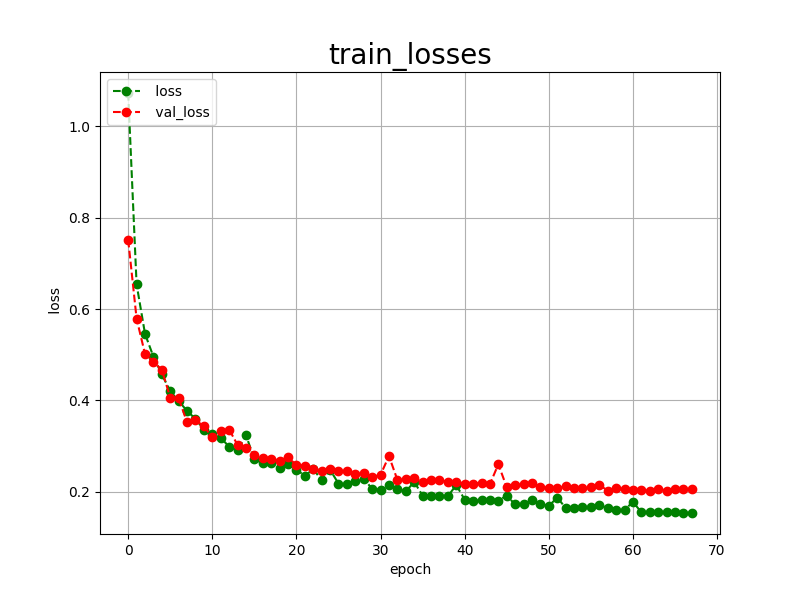 

 

<h3>
4 Evaluation
</h3>
Please move to <b>./projects/TensorFlowFlexUNet/CamVid11</b> folder, 
and run the following bat file to evaluate TensorFlowUNet model for CamVid11. 
<pre>
./2.evaluate.bat
</pre>
This bat file simply runs the following command.
<pre>
python ../../../src/TensorFlowFlexUNetEvaluator.py ./train_eval_infer.config
</pre>

Evaluation console output: 

  Image-Segmentation-Aerial-Imagery

<a href="./projects/TensorFlowFlexUNet/CamVid11/evaluation.csv">evaluation.csv</a> 

The loss (categorical_crossentropy) to this CamVid11/test was not low, and dice_coef_multiclass not high as shown below.
 
<pre>
categorical_crossentropy,0.2103
dice_coef_multiclass,0.9104
</pre>
 
<h3>
5 Inference
</h3>
Please move to <b>./projects/TensorFlowFlexUNet/CamVid11</b> folder 
,and run the following bat file to infer segmentation regions for images by the Trained-TensorFlowFlexUNet model for CamVid11. 
<pre>
./3.infer.bat
</pre>
This simply runs the following command.
<pre>
python ../../../src/TensorFlowFlexUNetInferencer.py ./train_eval_infer.config
</pre>

<b>mini_test_images</b> 
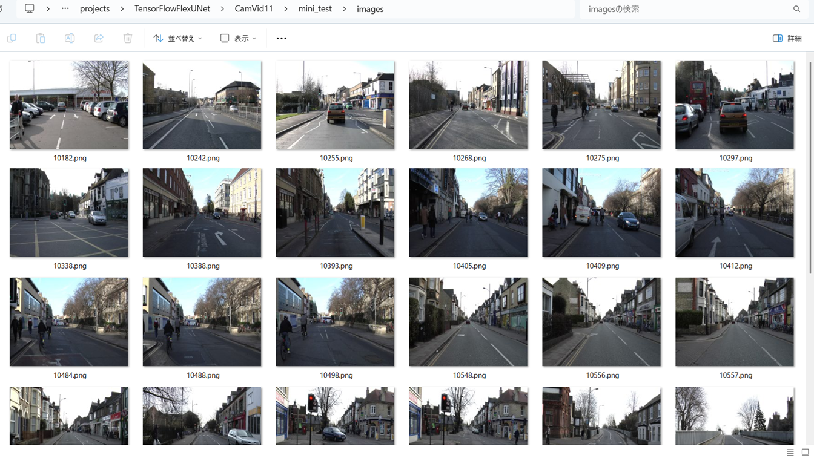 
<b>mini_test_mask(ground_truth)</b> 
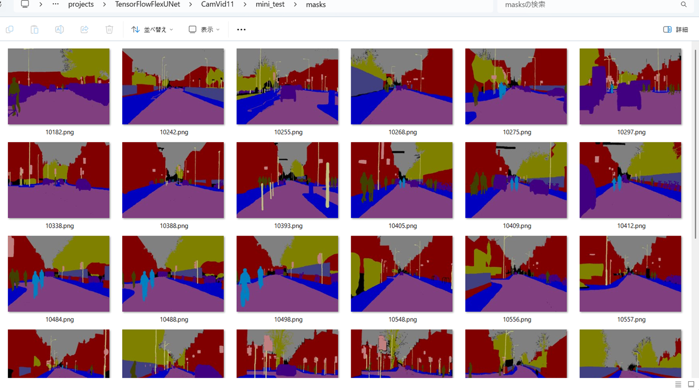 

<b>_inferred test masks</b> 
 
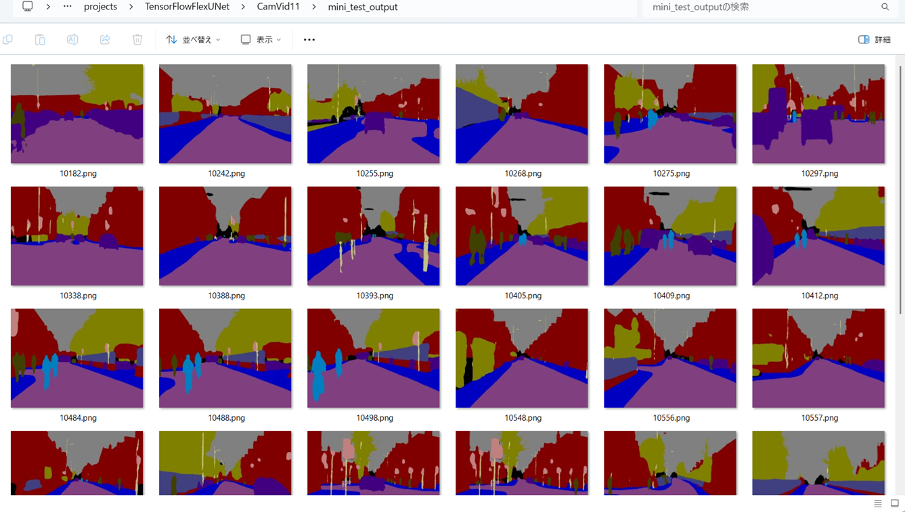 
 

<b>Enlarged images and masks for the CamVid11 682x512 pixels</b> 
As shown below, the inferred masks predicted by our segmentation model trained on the 
 dataset appear similar to the ground truth masks, but they lack precision in certain areas. 
<a href="#color_class_mapping_table">CamVid-11 Image color-class-mapping-table</a>

  
<table>
<tr>

<th>Image</th>
<th>Mask (ground_truth)</th>
<th>inferred-mask</th>
</tr>

<td>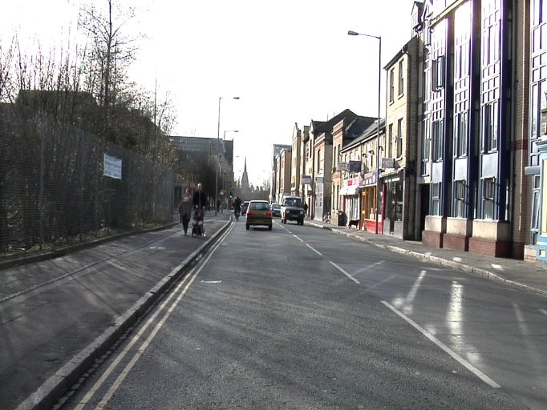</td>
<td>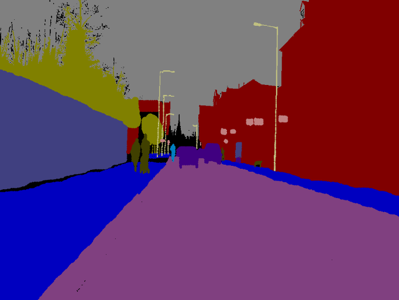</td>
<td></td>
</tr>
<tr>
<td></td>
<td></td>
<td></td>
</tr>
<tr>
<td>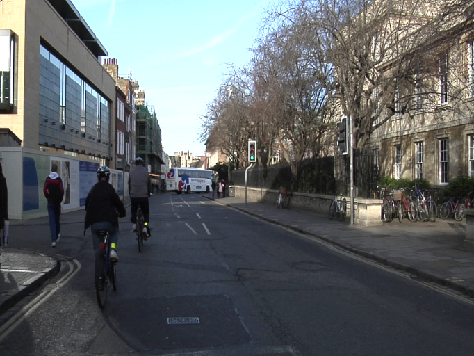</td>
<td>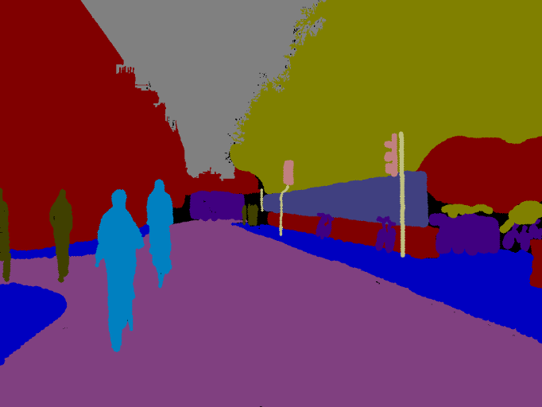</td>
<td></td>
</tr>

<tr>
<td>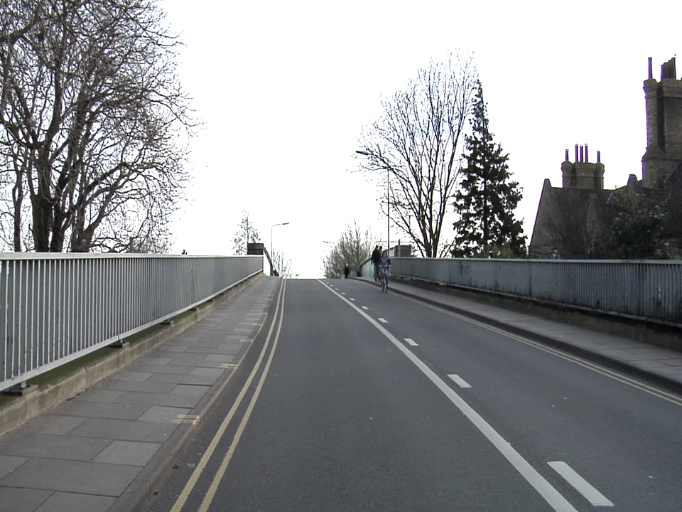</td>
<td>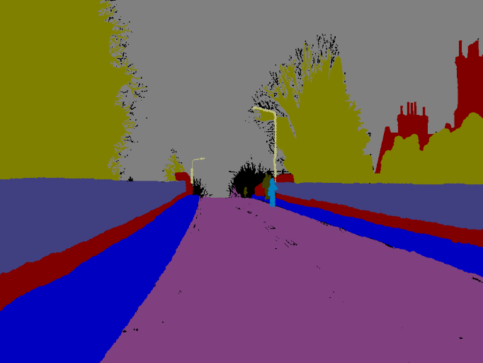</td>
<td></td>
</tr>
<tr>
<td>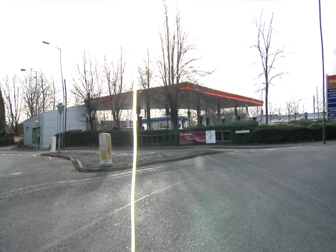</td>
<td>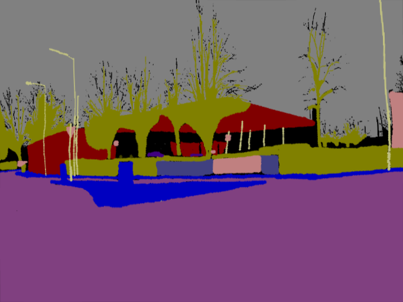</td>
<td></td>
</tr>
<tr>
<td>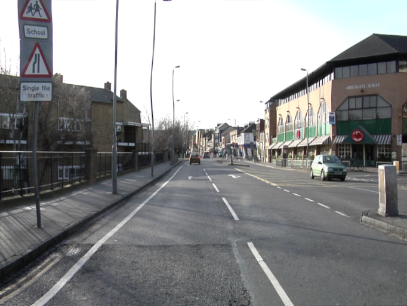</td>
<td>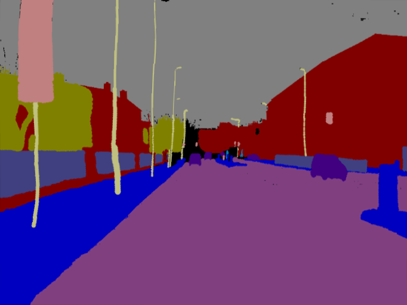</td>
<td></td>
</tr>
</table>

 

<h3>
References
</h3>
<b>1. Multiclass semantic segmentation of CamVid dataset using U-Net</b> 
William Wei 
<a href="https://github.com/yumouwei/camvid_unet_semantic_segmentation">
https://github.com/yumouwei/camvid_unet_semantic_segmentation
</a>
 
 
<b>2. TensorFlow-FlexUNet-Image-Segmentation-Model</b> 
Toshiyuki Arai antillia.com  
<a href="https://github.com/sarah-antillia/TensorFlow-FlexUNet-Image-Segmentation-Model">
https://github.com/sarah-antillia/TensorFlow-FlexUNet-Image-Segmentation-Model
</a>
 
 
<b>3. TensorFlow-FlexUNet-Tiled-Image-Segmentation-KITTI-Stereo-2015</b> 
Toshiyuki Arai antillia.com  
<a href="https://github.com/atlan-antillia/TensorFlow-FlexUNet-Tiled-Image-Segmentation-KITTI-Stereo-2015">
https://github.com/atlan-antillia/TensorFlow-FlexUNet-Tiled-Image-Segmentation-KITTI-Stereo-2015
</a>
 
 
